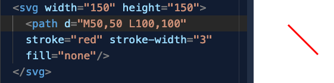
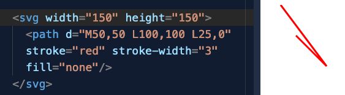
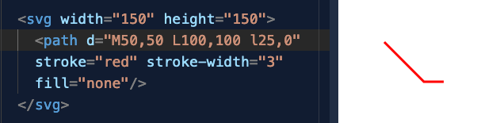

O elemento gráfico `<path>` aceita várias letras como parte das instruções para traçarmos as retas e curvas:
```
   M = move até
   L = linha até
   H = linha horizontal até
   V = linha vertical até
   C = curva até
   S = curva suave até
   Q = curva de Bézier
   T = curva de Bézier suave
   A = arco elíptico
   Z = fecha path
```
Várias (embora não todas) vêm em pares, MAIÚSCULA e minúscula. A versão maiúscula se refere a coordenadas absolutas e a versão minúscula a coordenadas relativas. Por exemplo:

`M 100,100` significa "Pegue uma caneta e a posicione nas coordenadas exatas 100,100" `m 100,100` significa "Pegue uma caneta e a posicione 100 para baixo e 100 para a direita a partir da posição em que a sua caneta se encontra agora." Se aplicarmos isso a um exemplo em código:



Vejamos agora a diferença entre inserir uma nova reta usando L (maiúsculo) e l (minúsculo):





Ou seja, quando utilizamos `L` o svg procura a coordenada absoluta dentro da "janela de visualização" do elemento. Quando utilizamos `l` o svg vai partir da posição atual da "caneta" (como se estivéssemos traçando com uma caneta, do ponto A ao ponto B) para então mover-se 25 à direita e fazer o traçado.

Este exemplo no [codepen](https://codepen.io/chrisnager/pen/zYNXJB) utiliza esse recurso de maiúsculas/minúsculas para criar um desenho utilizando poucas instruções de `<path>`.