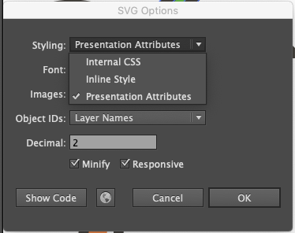

Quando usamos o Illustrator para exportar SVG, temos as seguintes alternativas:



(na versão em português: CSS interno, Estilo incorporado ou Atributos de apresentação)

Você pode escolher a que quiser para trabalhar, baseando-se na seguintes diferenças:

**CSS interno**: as propriedades de CSS geradas automaticamente na conversão pelo Illustrator vão aparecer no código dentro da tag `<style>`, como vimos em nosso arquivo da praia.

```
<defs>
  <style>
    .cls-1{fill:#6dbd45;}
    .cls-2{fill:#fff;}
    .cls-3{fill:#f68e49;}
  </style>
</defs>
```

**Estilo incorporado**: as propriedades de CSS são incorporadas dentro de cada tag, usando o atributo `style="propriedade: valor"` (veja como exemplo a propriedade `fill`).

```
<path d="M265,170.35S367.54,7.18,499,137.48C499,137.48,345.63,117.92,265,170.35Z" style="fill:#6dbd45"/>
```

**Atributos de apresentação**: Parecido com o estilo incorporado, porém aqui cada propriedade de CSS é adicionada como um atributo de HTML (por exemplo, a propriedade `fill`, diferente do exemplo anterior onde estava declarada com o atributo `style`, agora é ela mesma um atributo):

```
<path d="M265,170.35S367.54,7.18,499,137.48C499,137.48,345.63,117.92,265,170.35Z" fill="#6dbd45"/>
```

No modo "atributos de apresentação" é bem mais fácil alterarmos e adicionarmos as propriedades de CSS do SVG, uma vez que estamos usando a tag `<style>`, enquanto no "estilo incorporado" as propriedades são mais difíceis de localizar no código, pois estão espalhadas pelas tags.

É possível adicionar uma tag `<style>` para alterar o estilo original, porém só conseguimos realmente sobrescrever os valores usando `!important`, o que nem sempre é uma boa prática. Por exemplo, para alterar o código do exemplo acima:

```
<style>
  #exemplo {
    fill: #fff !important
  }
<style>

<path id="exemplo" d="M265,170.35S367.54,7.18,499,137.48C499,137.48,345.63,117.92,265,170.35Z" fill="#6dbd45"/>
```

O Illustrator tem outras ferramentas para a criação de SVGs, você pode consultar a [documentação](https://helpx.adobe.com/br/illustrator/using/svg.html) que está completa em português.