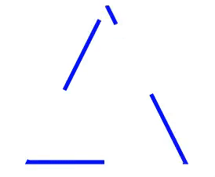
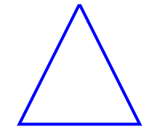
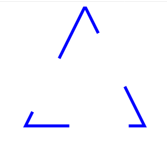
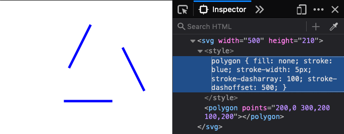
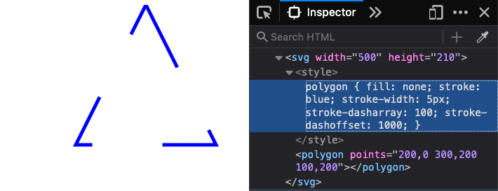

É possível animar SVGs para criar "loaders", aquelas imagens que vemos animadas enquanto o site ou sistema está em carregamento, de um jeito bem parecido com o que usamos para animar o lettering "Verão!" do projeto.



Vamos testar criando um triângulo da forma que já vimos na aula 1.
```
<svg width="500" height="210">
 <style>
   polygon {
     fill: none;
     stroke: blue;
     stroke-width: 5px;
   }
 </style>
 <polygon points="200,0 300,200 100,200"/>
</svg>
```

O resultado é um triângulo com bordas azuis, sem preenchimento.



Agora vamos adicionar a propriedade que utilizamos para animar a borda do lettering do projeto (`stroke-dasharray`):

```
<svg width="500" height="210">
 <style>
   polygon {
     fill: none;
     stroke: blue;
     stroke-width: 5px;
     stroke-dasharray: 100;
   }
 </style>
 <polygon points="200,0 300,200 100,200"/>
</svg>
```

Usando os valores de 100, conseguimos um efeito similar a este (mas você pode usar os valores que quiser):



Lembrando que quando modificamos os valores da propriedade `stroke-dashoffset`, os traços mudam de posição, vamos animar essa propriedade para criar o loader.

Por enquanto o valor de `stroke-dashoffset` é 0. Se a ideia é fazer o loader "girar"continuamente, vamos inspecionar o código e modificar um pouco os valores para checar qual é o valor de `stroke-dashoffset` após o stroke dar um giro completo:



Aumentando o valor um pouco mais, damos um "loop" completo na animação:



Com um valor de `stroke-dashoffset` de 1000, conseguimos simular pelo inspetor de código uma volta completa no traçado, parando no mesmo lugar. Agora vamos inserir esses valores em uma animação `@keyframes`:

```
@keyframes loader {
    0% {
        stroke-dashoffset: 0;
    }

    100% {
        stroke-dashoffset: 1000;
    }
}
```

Assim como utilizamos o `to` no projeto, também podemos usar outros valores, como porcentagens (no caso, em 0% e 100% de conclusão da animação). Agora, vamos "chamar" essa animação no código:

```
polygon {
    fill: none;
    stroke: blue;
    stroke-width: 5px;
    stroke-dasharray: 100;
    animation: loader 2.5s linear infinite;
}
```

A animação `animation: loader 2.5s linear infinite`; leva as propriedades `name: loader`, `duration: 2.5s`, `timing-function: linear` e `iteration-count: infinite`.

Utilizamos `linear` ao invés de `ease` para que o ritmo da animação seja contínuo, sem ficar alternando entre rápido e devagar. Mas por que tivemos que calcular a posição de `dash-offset`? Para que a animação sempre termine no mesmo lugar que começou, dando a impressão de continuidade.

O código final ficou dessa forma:

```
<svg width="500" height="210">
    <style>
        polygon {
            fill: none;
            stroke: blue;
            stroke-width: 5px;
            stroke-dasharray: 100;
            animation: loader 2.5s linear infinite;
        }

        @keyframes loader {
            0% {
                stroke-dashoffset: 0;
            }

            100% {
                stroke-dashoffset: 1000;
            }
        }
    </style>
    <polygon points="200,0 300,200 100,200"/>
</svg>
```

E a visualização no navegador:

