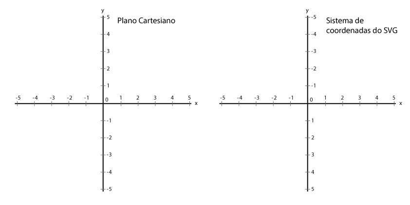
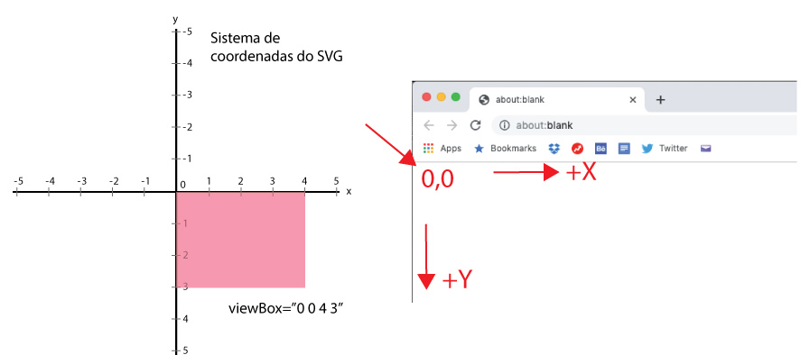

Se você lembra das aulas de matemática da escola, talvez tenha achado algo estranho nas coordenadas que usamos para posicionar os elementos no `viewBox`. Por que os valores negativos no eixo Y estão no plano "acima" do zero, e não "abaixo", que é a forma como aprendemos?

Um sistema de coordenadas pode ser estabelecido conforme a necessidade de uso. Na aula de matemática aprendemos o Plano Cartesiano, porém ele é apenas um desses sistemas, e existem vários outros.

O SVG (e também o CSS) tem seu sistema de coordenadas próprio. Nesse sistema, cada elemento `<svg>` tem como ponto inicial de seu `viewPort` as coordenadas (0,0) e a partir daí as dimensões largura/altura são calculadas no sentido esquerda/direita e cima/baixo. O posicionamento dos elementos nas telas dos navegadores e dispositivos móveis (os `viewPorts`) seguem a mesma lógica. Então fica muito mais fácil trabalhar com um sistema onde o eixo Y utilize números positivos "abaixo" do zero, e não acima.

Dessa forma, podemos trabalhar sempre com valores positivos quando criamos elementos e também quando adicionamos margens internas e externas, e os valores negativos passam a significar, em alguns casos, a situações fora do campo de visualização do `viewBox` e do `viewPort`.

