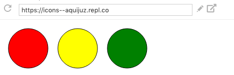
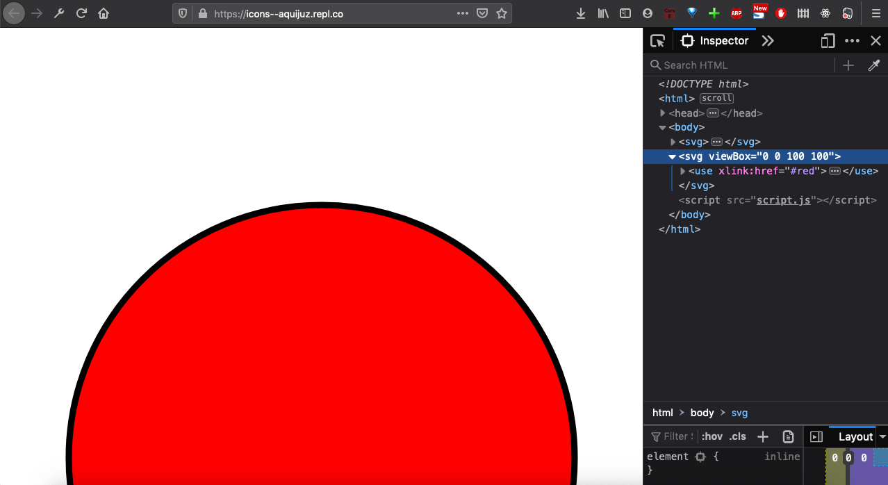
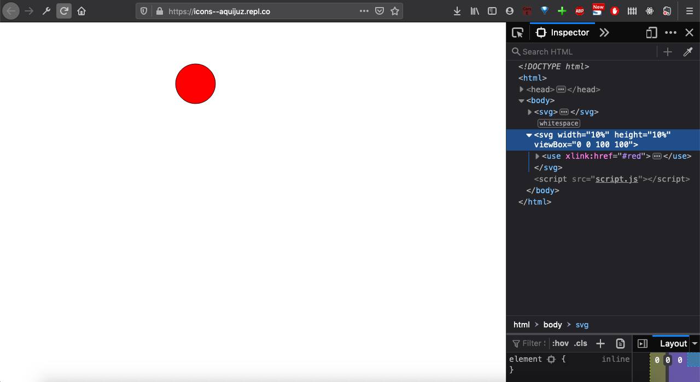
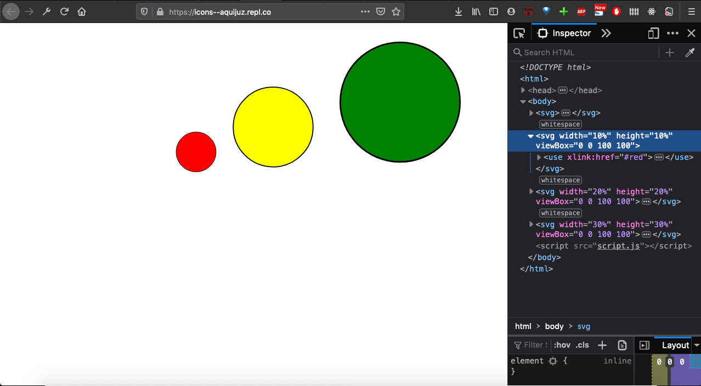
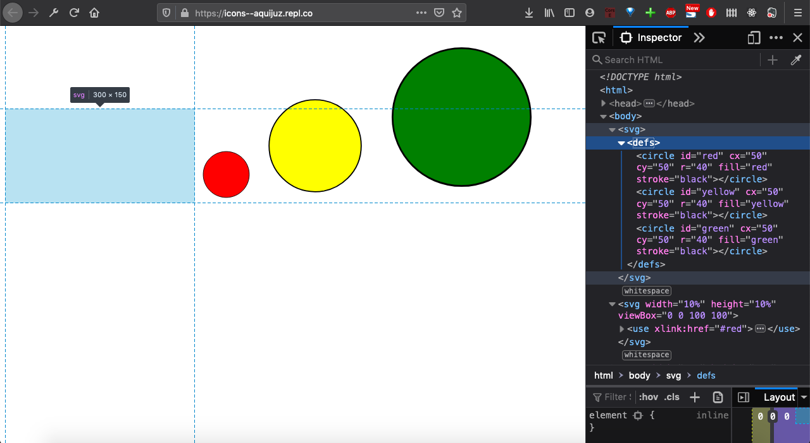
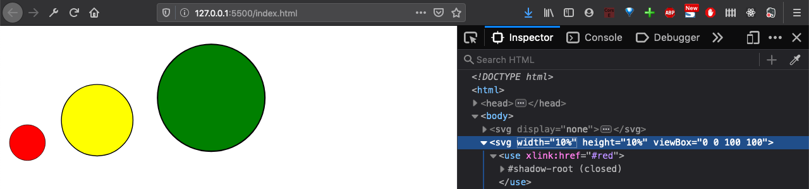

Ícones (como os que usamos para identificar redes sociais) são um recurso super útil. Existem várias bibliotecas disponíveis onde podemos importar ícones para nossas aplicações web, como a [fontAwesome](https://fontawesome.com/), mas também é possível utilizar SVG para criar ícones e disponibilizá-los em nosso código!

Uma das vantagens é a possibilidade de inserir ícones como código SVG inline, reduzindo assim a quantidade de requisições HTTP. Utilizando a propriedade `viewBox`, podemos declarar uma seleção de ícones direto no HTML e visualizar apenas o ícone que queremos.

Neste exemplo, vamos gerar um vetor de três ícones diferentes (ilustrados pelos círculos abaixo) e fazer com que apenas um deles seja exibido por vez.

Vamos começar desenhando nossos vetores:

```
<svg>
   <circle id="red" cx="50" cy="50" r="40" fill="red" stroke="black" />
   <circle id="yellow" cx="50" cy="50" r="40" fill="yellow" stroke="black" />
   <circle id="green" cx="50" cy="50" r="40" fill="green" stroke="black" />
</svg>
```



Cada um dos círculos foi desenhado em coordenadas que respeitam essas dimensões: lembrando que o `<circle>` sempre é vetorizado a partir de seu ponto central, que definimos como (50, 50) para cada um, com um raio de 80. Ou seja, cada `<circle>` vai ocupar um espaço de 100x100 e terá 80 de raio.

A ideia aqui é visualizar somente um círculo por vez, então vamos usar a tag `<defs>` para dizer que estamos definindo três objetos gráficos (os círculos), porém ainda não estamos renderizando nenhum deles na tela. Só estão definidos!

```
<svg>
 <defs>
   <circle id="red" cx="50" cy="50" r="40" fill="red" stroke="black" />
   <circle id="yellow" cx="50" cy="50" r="40" fill="yellow" stroke="black" />
   <circle id="green" cx="50" cy="50" r="40" fill="green" stroke="black" />
 </defs>
</svg>
```

Se recarregarmos a tela do navegador, os círculos sumiram. Agora estão dentro da tag `<defs>` esperando para serem "chamados" em alguma parte do código. Viu que cada um dos círculos tem seu próprio `id`? É através dele que vamos identificar cada círculo.

Então vamos exibir na tela o círculo vermelho. Usando o `id`, podemos criar um novo em alguma parte do código e "chamar" o círculo, da seguinte forma:

```
<svg viewBox="0 0 100 100">
  <use xlink:href="#red"/>
</svg>
```

Com o atributo `viewBox`, definimos uma nova janela de visualização para o `<svg>` com a proporção de 100x100, e usamos a tag `<use>` para chamar o círculo usando o `id`. Vamos ver o resultado:



Um pouco grande? Tudo bem, podemos atribuir altura e largura ao SVG, com unidades absolutas ou dinâmicas.

```
<svg width="10%" height="10%" viewBox="0 0 100 100">
 <use xlink:href="#red"/>
</svg>
```



Podemos chamar cada um dos ícones de forma independente:

```
<svg width="10%" height="10%" viewBox="0 0 100 100">
 <use xlink:href="#red"/>
</svg>
```

```
<svg width="20%" height="20%" viewBox="0 0 100 100">
 <use xlink:href="#yellow"/>
</svg>
```

```
<svg width="30%" height="30%" viewBox="0 0 100 100">
 <use xlink:href="#green"/>
</svg>
```



Por último: O SVG base que criamos para definir os ícones está ocupando espaço no markup, mesmo sem exibir os objetos gráficos. Como podemos nos livrar dele?



Vamos adicionar `display:"none"` ao svg onde estão os modelos:

```
<svg display="none">
    <defs>
    <circle id="red" cx="50" cy="50" r="40" fill="red" stroke="black" />
    <circle id="yellow" cx="50" cy="50" r="40" fill="yellow" stroke="black" />
    <circle id="green" cx="50" cy="50" r="40" fill="green" stroke="black" />
    </defs>
</svg>
```



Esse é um modo bastante interessante para se utilizar ícones em SVG, como opção ao uso de ícones importados de bibliotecas de fontes.